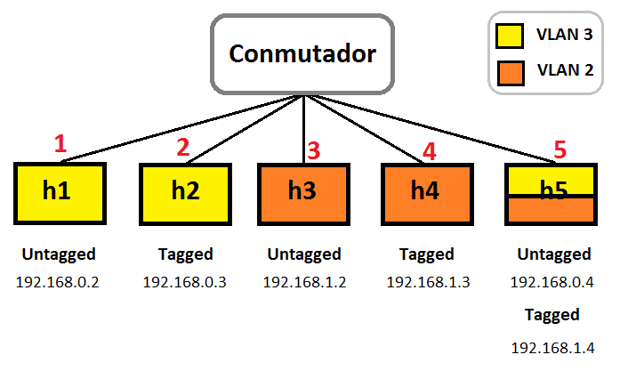
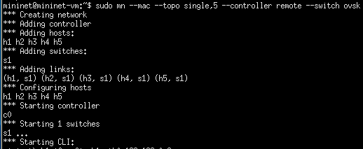
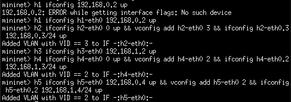
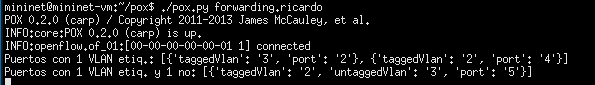

# Conmutador Openflow

### Conmutador con soporte de VLAN

En primer lugar arrancamos un escenario que coincida con la figura anterior:

Configuramos las IPs de cada host para que haya dos subredes IP:

Arrancamos el módulo que hemos programado, que en mi caso se encontraba dentro de la carpeta forwarding, igual que el ejemplo del que partimos:

Podemos comprobar que además de los mensajes normales aparecen dos que nos indican qué hosts (realmente qué puertos) tienen que ser configurados, o bien por tener una VLAN etiquetada o una etiquetada y una no. Esto lo hacemos con una función que explicaremos en el apartado de documentación del código.

NOTA: El fichero config.TXT es para demostrar que se conseguía lo mismo que utilizando config.py, pero el programa utiliza el fichero config.PY