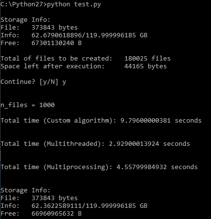

# Troll safe delete

Overwrite free space with the file you want. Example: Before giving back your work laptop, delete everything and fill the hard drive with your CV 


## Usage

```
python main.py -f FILE [-n NUMBER_COPIES] [-d DIRECTORY]  [-t THREADS]
```

## Testing different ways to do this


